## CSS 盒模型（by 元丰）

### 目录

- [盒模型基本概念/区别/实现](#1)
- [JS 如何获取盒模型的宽高](#2)
- [什么是外边距重叠](#3)
- [BFC(边距重叠解决方案)](#4)

### <span id="1">盒模型基本概念/区别/实现</span>

#### 标准盒模型

标准盒模型包括 content、border、padding、margin。

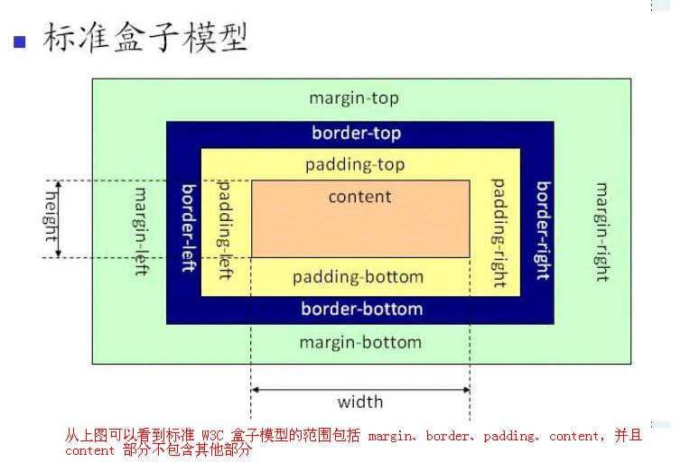

#### IE 盒模型

IE 盒模型也包括 content、border、padding、margin。

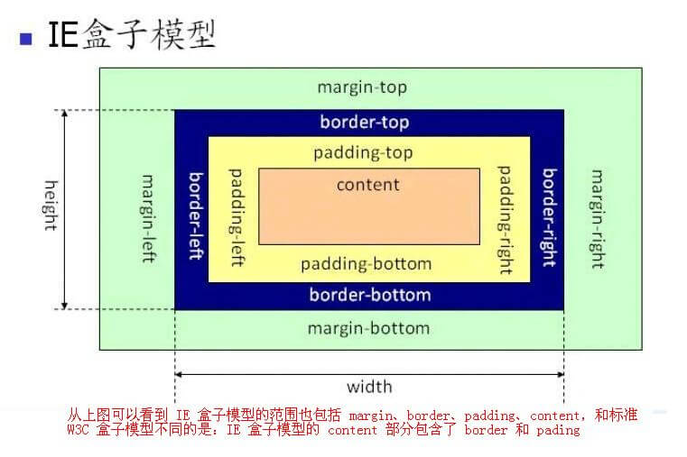

#### 区别

主要体现在盒模型获取宽度的方式不同

**标准盒模型宽度 = content 的宽度**

**IE 盒模型宽度 = content 的宽度 + border 的宽度 + padding 的宽度**

#### 实现

通过 `box-sizing` 属性来设置。

**标准盒模型：** 浏览器默认，设置为 `box-sizing: content-box;`

**IE 盒模型：** 设置为 `box-sizing: border-box;`

### <span id="2">JS 如何获取盒模型的宽高</span>

- dom.style.width/height，只适用于获取内联样式的宽和高；
- dom.currentStyle.width/height，获取元素渲染后的宽和高，只有 ie 支持；
- window.getComputedStyle(dom).width/height，获取元素渲染后的宽和高，chrome、firefox 都支持，通用性、兼容性更好；
- dom.getBoundingClientRect().width/height，计算一个元素相对于视窗的绝对位置，能获取到四个属性：top、left、width、height。

### <span id="3">什么是外边距重叠</span>

#### 基本概念

外边距合并是指两个垂直外边距相遇时，它们将形成一个外边距。合并后的高度等于两个发生合并的外边距的高度中的较大者。

#### 类型一：父子元素的外边距重叠

当一个元素包含另一个元素中时，它们的上/下外边距会发生合并。


#### 类型二：兄弟元素的外边距重合

当一个元素出现在另一个元素上面时，第一个元素的下边距会与第二个元素的上边距发生合并。

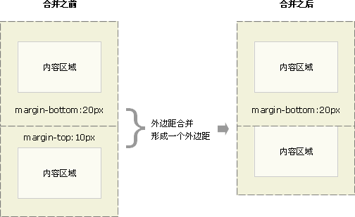

#### 类型三：空元素的外边距合并

空元素的上边距和下边距碰到一起（仅有外边距，没有边框或内边距），便会发生合并。

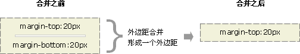

如果空元素的外边距遇到另外一个元素的外边距时还会发生合并

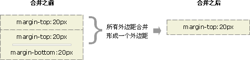

### <span id="4">BFC(边距重叠解决方案)</span>

#### 基本概念

BFC（Block formatting context）块级格式化上下文，是一个独立渲染区域。

#### BFC 原理/渲染规则

- BFC 元素垂直方向上的外边距会叠加；
- BFC 元素的区域不会与 float 元素的区域重叠；
- BFC 元素在页面上是一个独立容器，容器内部的子元素不会影响到外部元素，反之亦然；
- 计算 BFC 元素高度时，设置浮动的子元素也会参与计算。

#### 如何创建 BFC

- float 不为 none；
- position 为 absolute 或 fixed；
- display 为 inline-block、table 系列（如 table、table-cell 等）
- overflow 不为 visible。

#### BFC 的应用

- 阻止元素外边距重叠

如果第一个 div 的下边距为 10px，第二个 div 的上边距为 30px，那么这两个元素垂直方向上的外边距会重叠，此刻两个元素的边距为 30px。我们可以在第一/二个的外面包一层容器，并设置该容器为 BFC，就可以避免外边距重叠的问题。

```
// html
<h3>BFC 的应用一：阻止元素外边距重叠</h3>
<div class="css-wrap-1">
  <div class="first-wrap">
    <div class="first">第一部分</div>
  </div>
  <div class="second">第二部分</div>
</div>

// css
.css-wrap-1 .first, .css-wrap-1 .second{
  color: #f55;
  background-color: #fcc;
  display: flex;
  align-items: center;
  justify-content: center;
  width: 300px;
  height: 100px;
}
.css-wrap-1 .first-wrap {
  /* 设置 BFC */
  overflow: hidden;
}
.css-wrap-1 .first {
  margin-bottom: 10px;
}
.css-wrap-1 .second {
  margin-top: 30px;
}
```
外边距叠加：<br/>
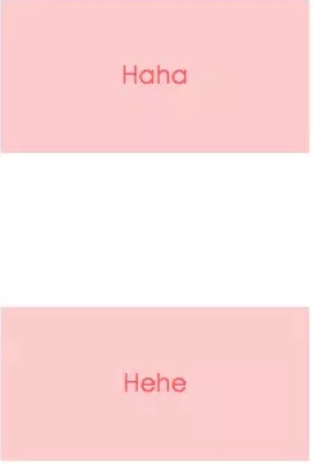

外边距不重叠：<br/>
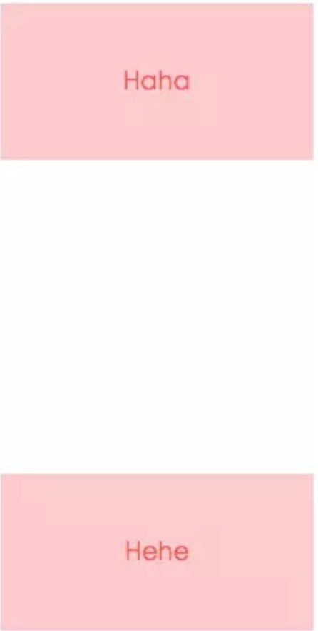

- 阻止元素被浮动元素覆盖

如果浮动元素后面跟一个非浮动元素就会产生覆盖现象，两栏布局都是通过设置非浮动元素为 BFC 的方式来实现的。

```
// html
<h3>BFC 的应用二：阻止元素被浮动元素覆盖</h3>
<div class="css-wrap-2">
  <div class="first">第一部分</div>
  <div class="second">第二部分</div>
</div>

// css
.css-wrap-2 .first {
  width: 100px;
  height: 100px;
  background-color: #f55;
  float: left;
}
.css-wrap-2 .second {
  /* 设置 BFC */
  display: inline-block;
  width: 200px;
  height: 150px;
  background-color: #fcc;
}
```
非浮动元素被覆盖：<br/>
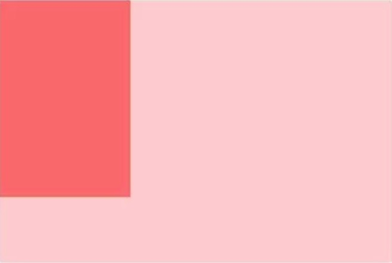

非浮动元素设置为 BFC：<br/>
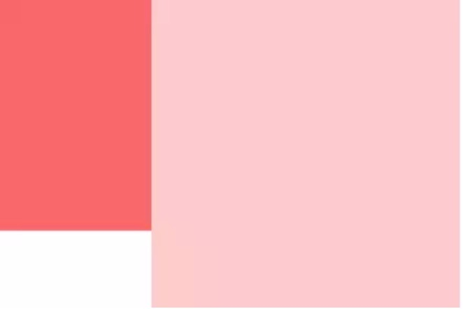

- 高度计算包含浮动子元素

一个容器内部元素若都为浮动元素，且容器未设置高度则容器高度便会塌陷，通过设置 BFC 可解决问题。

```
// html
<h3>BFC 的应用三：高度计算包含浮动子元素</h3>
<div class="css-wrap-3">
  <div class="first">第一部分</div>
  <div class="second">第二部分</div>
</div>

// css
.css-wrap-3 {
  width: 300px;
  border: 2px solid #f55;
  /* 设置 BFC */
  float: left;
}
.css-wrap-3 .first, .css-wrap-3 .second {
  width: 100px;
  height: 100px;
  border: 2px solid #fcc;
  float: left;
}
```

容器高度塌陷：<br/>
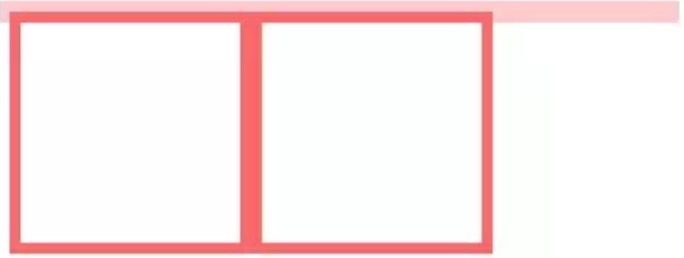

设置 BFC 后，容器高度正常：<br/>
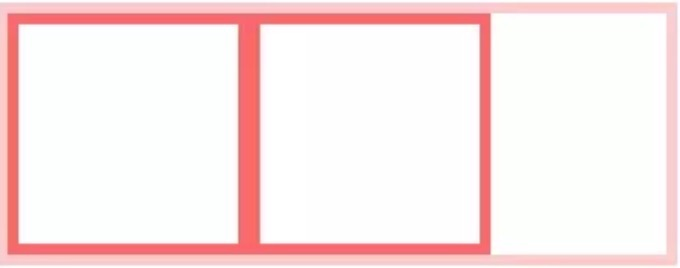

