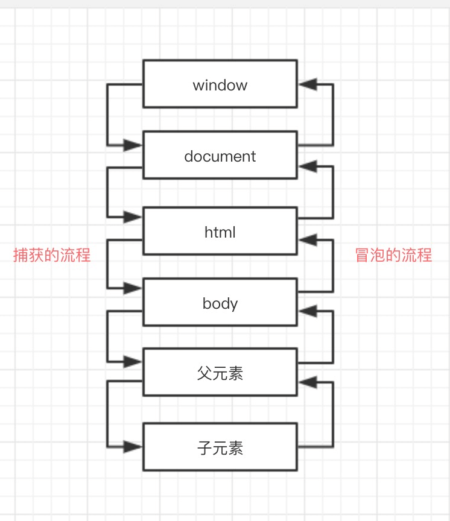
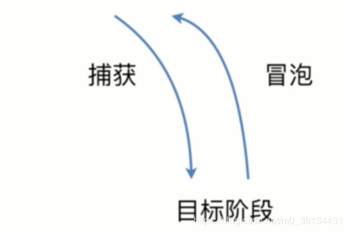

## DOM 事件

### 目录

- [基本概念（dom 事件的级别）](#1)
- [dom 事件模型](#2)
- [dom 事件流](#3)
- [什么是 event 对象及常见应用](#4)
- [自定义事件](#5)

### <span id="1">基本概念（dom 事件的级别）</span>

#### DOM0

各种浏览器都支持
```
element.onclick = function () {}
```

#### DOM1（忽略）

未涉及事件级别的定义

#### DOM2

增加两个方法用于处理指定和删除事件处理程序的操作：

- `addEventListener(事件名, 回调函数, 冒泡/捕获)`
- `removeEventListener(事件名, 回调函数, 冒泡/捕获)`

捕获为 true，冒泡为 false

```
element.addEventListener('click', function () {}, false)
```

#### DOM3

新增了几个事件名，如 `keyup`

### <span id="2">dom 事件模型</span>

#### 事件冒泡

**概念：** 事件开始时由最具体的元素（文档中嵌套层次最深的那个节点）接收，然后逐级向上传播到较为不具体的节点（文档）

**案例：**

```
<!DOCTYPE html>
<html>
  <head>
    <title>Event Demo</title>
  </head>
  <body>
    <div> Click Me </div>
  </body>
</html>
```

若点击了 div 元素，那么 click 事件会按下列顺序传播

1. div
2. body
3. html
4. document
5. window

**解析：** click 事件首先在 div 元素上发生，然后沿着 dom 树向上传播，每一级节点上都会发生，直至传播到 document 对象，如图所示。



#### 事件捕获

**概念：** 事件捕获的思想是不太具体的节点应该更早接收事件，而具体的元素应该最后接收事件。

若仍然以上面的代码作为案例，如果点击 div 元素，那么 click 事件会按下列顺序传播

1. window
2. document
3. html
4. body
5. div

**解析：** 在事件捕获的过程中，document 对象会首先接收到 click 事件，然后事件沿 dom 树一次往下，一直传播到事件的实际目标，即 div 元素。

代码示例
```
const dom = document.querySelector('#dom')
/**
  * 事件捕获案例，冒泡反之即可
  * 输出捕获顺序如下，即使监听时乱序
  * 1. window
  * 2. document
  * 3. html
  * 4. body
  * 5. div
  */
// 监听 html
document.documentElement.addEventListener('click', function () {
  console.log('捕获 html')
}, true)

// 监听 window
window.addEventListener('click', function () {
  console.log('捕获 window')
}, true)

// 监听 body
document.body.addEventListener('click', function () {
  console.log('捕获 body')
}, true)

// 监听 div
dom.addEventListener('click', function () {
  console.log('捕获 div')
}, true)

// 监听 document
document.addEventListener('click', function () {
  console.log('捕获 document')
}, true)
```

#### 拓展：JS 获取 DOM 元素的方法

- 通过 id 获取：getElementById
- 通过 name 属性：getElementsByName
- 通过标签名：getElementsByTagName
- 通过类名：getElementsByClassName
- 获取 html 元素的方法：document.documentElement
- 获取 body 元素的方法：document.body
- 获取 title 元素的方法：document.title
- 通过选择器获取一个元素：querySelector
- 通过选择器获取一组元素：querySelectorAll

### <span id="3">dom 事件流</span>

#### 概念

**DOM2 级事件**规定的事件流包括三个阶段：

1. 事件的捕获阶段
2. 事件的目标阶段（触发元素自身的事件）
3. 事件的冒泡阶段

#### 说明

- 若捕获事件和冒泡事件都存在，首先发生的是捕获阶段，然后是目标阶段，最后才是冒泡阶段

- addEventListener() 第三个参数为是否捕获：
  - 如果为 true，表示该事件在捕获阶段发生；
  - 如果为 false，表示该事件在冒泡阶段发生。

- IE8 及更早版本不支持 DOM 事件流

#### 图解



### <span id="4">什么是 event 对象及常见应用</span>

#### DOM 中的事件对象

| 属性和方法 | 类型 | 描述 |
| - | - | - |
| event.bubbles | Boolean | 指示事件是否为冒泡事件类型 |
| event.currentTarget | Element | 返回其事件监听器触发该事件的元素（父级元素）|
| event.target | Element | 返回触发该事件的元素（事件的目标元素）|
| event.type | String | 返回当前 Event 对象表示的事件名称 |
| event.preventDefault() | Function | 阻止默认事件 |
| event.stopPropagation() | Function | 阻止冒泡 |
| event.stopImmediatePropagation() | Function | 同一元素绑定同一个事件的多个处理函数，可以用这个来提高优先级，屏蔽另一个事件函数的发生 |

#### IE 中的事件对象

| 属性和方法 | 类型 | 描述 |
| - | - | - |
| event.cancelBubble | Boolean | 可赋值，默认 false，同 event.stopPropagation() |
| event.returnValue | Boolean | 可赋值，默认 true，同 event.preventDefault() |
| event.srcElement | Element | 同 event.target

#### Event 的兼容写法

- 获取 event 对象：`event || (event = window.event)`
- 获取 target 对象：`event.target || event.srcElement`
- 阻止默认事件：`event.preventDefault ? event.preventDefault() : (event.returnValue = false)`
- 阻止冒泡：`event.stopPropagation ? event.stopPropagation() : (event.cancelBubble = true)`

### <span id="5">自定义事件</span>

```
// 创建事件
const event = new Event('custom')
// 注册事件监听器
dom.addEventListener('custom', function () {
  console.log('触发了自定义事件')
})
// 触发事件
dom.dispatchEvent(event)
```