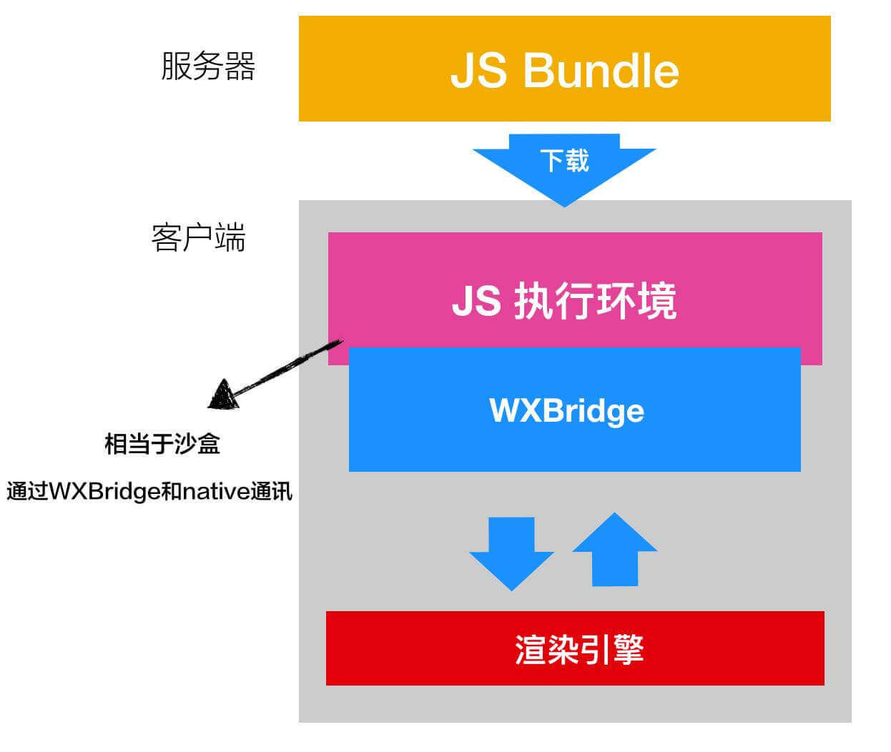
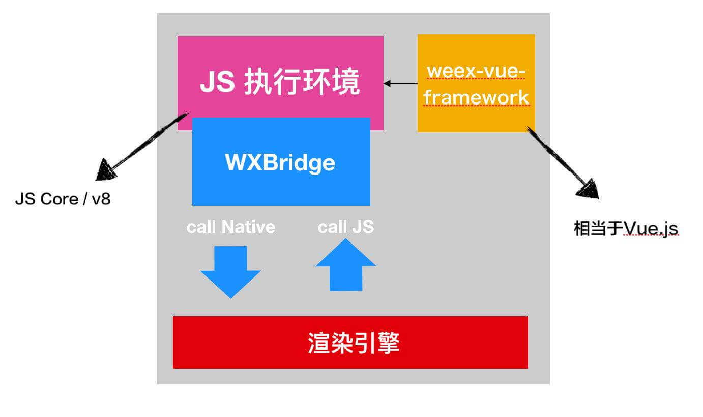
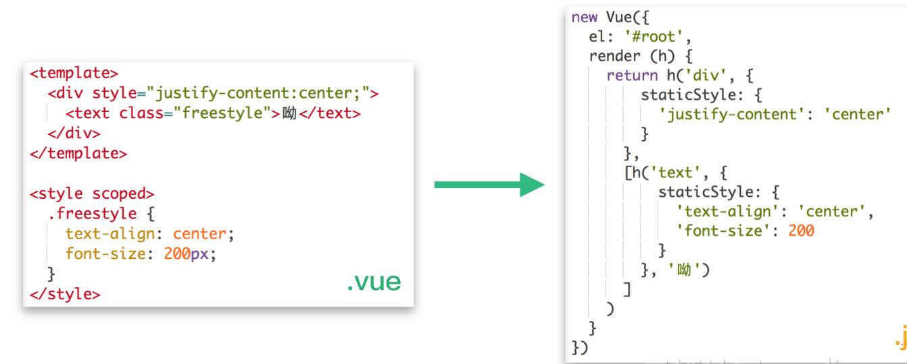

## weex 脚手架全面解读

当前解读的脚手架是基于 weex 官方脚手架的升级版。

目录：

  - [项目特征](#1)
      - [weex 开发平台](#11)
      - [控制台日志输出](#12)
  - [目录详解](#2)
      - [文件目录](#21)
      - [package.json](#22)
      - [webpack.config.js](#23)
      - [.temp 文件夹与 src/entry.js](#24)
      - [build 文件夹](#25)
          - [webpack.common.conf.js](#251)
          - [webpack.dev.conf.js](#252)
          - [webpack.prod.conf.js](#253)
      - [src/modules 文件夹](#26)
      - [config.json 文件](#27)
  - [简述 weex 工作机制](#3)
  - [问题解答](#4)
  - [展望](#5)

### <span id="1">项目特征</span>

- 可视化开发平台
- 支持一键启动单入口调试和全量调试
- 可视化路由管理（支持路由新建、删除）
- 开发阶段本地和 app 同步热刷新
- 开发阶段 css 样式智能检测与错误提示
- PC 和移动端预览模式灵活切换
- 友好的控制台日志输出格式
- 快速切换本地 host
- 支持 async/await
- 支持 less 部分功能，如变量名（mixin 方法、选择器嵌套等功能受限于框架）

#### <span id="11">weex 开发平台</span>

启动开发平台

`npm run ui`

开发平台部分功能说明

- **新建/删除路由** 详情见平台弹窗，需要说明一点删除路由并不会同步删除 api 文件，因为该文件可能会被多个业务公用；
- **启动/关闭服务** 将启动单入口调试服务 **（推荐）**，该模式不会因为项目文件内容的增多而导致启动/热刷新变慢；
- **启动全量调试服务** 当开发任务存在互相关联的 weex 页面时使用，如同一项目内 weex 页面间的跳转；
- 页面预览页可使用 app 扫码调试，可查看 native 端源码；
- 使用手机预览模式调试更便捷。

#### <span id="12">控制台日志输出</span>

开发阶段针对 css 端的日志输出主要分为以下几种形式：

- **ERROR** 表示该 css 属性目前 weex 完全不支持；
- **NOTE** 表示该属性不是 weex 的推荐写法，但 weex 在打包过程中支持自动修复；
- **WARNING** 表示该属性在不同端可能有不同的表现形式，存在兼容性问题。

以上控制台提示都是针对 **native** 端的兼容问题，也许 H5 端显示正常，但是都需要进行 css 样式调整，避免出现不必要的兼容问题。

### <span id="2">目录详解</span>

#### <span id="21">文件目录</span>

    |-- weex-code-weiyi
        |-- .temp                       用于 webpack 打包的入口文件
        |   |-- insurance
        |   |   |-- demo
        |   |       |-- index.js        web 端入口
    |   |       |-- index.web.js        native 端入口
        |-- build       webpack 配置文件
        |   |-- webpack.common.conf.js  通用配置
        |   |-- webpack.dev.conf.js     开发环境配置
        |   |-- webpack.prod.conf.js    生产环境配置
        |-- config                      环境变量配置
        |   |-- weex.config.dev.js      开发    
        |   |-- weex.config.prod.js     生产
        |   |-- weex.config.test.js     测试
        |   |-- index.js
        |-- dist        打包文件目录
        |   |-- insurance
        |       |-- demo
        |           |-- index.js        用于 native 端解析
        |           |-- index.web.js    用于 web 端解析
        |   |-- weex-zip                压缩包目录，用于上传到 kano
        |       |-- insurance-demo-index.zip        压缩了 index.js 和 index.web.js
        |-- plugins                     插件目录，暂未使用
        |   |-- plugins.json
        |-- server                      weex 工作台服务器
        |-- src                         业务文件目录
        |   |-- api                     api 接口相关
        |   |   |-- modules             api 模块
        |   |       |-- insurance       
        |   |       |   |-- demo.js
        |   |   |-- gateway-api.js      请求方法封装
        |   |   |-- index.js
        |   |-- lib                     工具方法
        |   |-- modules                 weex 模块 H5 实现
        |   |   |-- log
        |   |   |-- monitor
        |   |   |-- nav
        |   |   |-- share
        |   |   |-- user
        |   |   |-- index.js
        |   |-- pages                   weex 页面
        |       |-- components
        |       |-- insurance
        |       |   |-- demo
        |       |       |-- components
        |       |       |-- index.vue
        |   |-- entry.js                入口模板，用于生成 .temp 文件下 web 端和 native 端入口
        |-- test                        测试用例
        |-- web                         weex 工作台前端页面
        |-- .babelrc                    babel 配置文件
        |-- .eslintignore               eslint 忽略的文件目录
        |-- .eslintrc.js                eslint 配置规则
        |-- .gitignore                  git 忽略的文件目录
        |-- .gitlab-ci.yml              git-ci 运行文件
        |-- .postcssrc.js               postcss配置文件
        |-- android.config.json         android 配置，暂未使用
        |-- ios.config.json             ios 端配置，暂未使用
        |-- config.json                 项目配置文件，重要！！！用于修改全局配置项
        |-- webpack.config.js           根据当前环境判定，最终输出的 webpack 配置项
        |-- package.json                
        |-- README.md

#### <span id="22">package.json</span>

解读一个项目结构最好的入口就是 package.json，代码如下：

```
{
  "scripts": {
    // 启动 weex 开发平台
    "ui": "node ./server/app.js",
    // 开发模式使用全量打包
    "dev": "cross-env NODE_ENV=development webpack-dev-server --progress",
    // 生产环境使用全量打包
    "build:prod": "cross-env NODE_ENV=production webpack",
    // 测试环境使用全量打包
    "build:test": "cross-env NODE_ENV=test webpack",
    // 开发环境使用单页打包
    "dev:single": "cross-env NODE_ENV=development PACKAGE_PATH=insurance/demo/index webpack-dev-server --progress",
    // 生产环境使用单页打包
    "build:prod:single": "cross-env NODE_ENV=production PACKAGE_PATH=insurance/demo/index webpack",
    // 测试环境使用单页打包
    "build:test:single": "cross-env NODE_ENV=test PACKAGE_PATH=insurance/demo/index webpack"
  }
}
```

##### cross-env

用于抹平不同平台（如 windows等）设置环境变量方式的差异，cross-env 之后 webpack/webpack-dev-server 之前即在设置环境变量。

##### 环境变量

环境变量完全可以自定义，当前使用以下变量：

- NODE_ENV：设置开发/测试/生产环境

- PACKAGE_PATH：需要打包的文件路径，不传则表示全量打包

##### 命令参数

- webpack/webpack-dev-server：使用 webpack/webpack-dev-server 进行打包。

- --config：指定配置文件进行构建，不指定则默认为 webpack.config.js，本项目为默认。

- --progress：打印出编译进度的百分比值。

参考：https://webpack.docschina.org/api/cli/#%E5%B8%B8%E7%94%A8%E9%85%8D%E7%BD%AE

#### <span id="23">webpack.config.js</span>

通过 package.json 设置的环境变量 `NODE_ENV` 来区分当前环境应该加载哪个打包配置文件，代码如下：

```
let webpackConfig
module.exports = () => {
  switch (process.env.NODE_ENV) {
    case 'prod':
    case 'production':
      webpackConfig = require('./build/webpack.prod.conf')
      break
    case 'test':
    case 'testing':
      webpackConfig = require('./build/webpack.test.conf')
      break
    case 'dev':
    case 'development':
    default:
      webpackConfig = require('./build/webpack.dev.conf')
  }
  return webpackConfig
}
```

分别查看三个文件的导出，如下：

```
// webpack.dev.conf
module.exports = new Promise((resolve, reject) => {
  // ...省略了很多代码
  resolve(webConfig)
})
// webpack.test.conf
module.exports = [weexConfig, webConfig]
// webpack.prod.conf
module.exports = [weexConfig, webConfig]
```

疑问：命令行 webpack 能加载几种类型的配置文件？

三种。

```
// 导出为一个函数，如下代码
module.exports = function(env, argv) {
  return {
    mode: env.production ? 'production' : 'development',
    devtool: env.production ? 'source-maps' : 'eval'
  }
}
// 导出一个 Promise
module.exports = () => {
  return new Promise((resolve, reject) => {
    setTimeout(() => {
      resolve({
        entry: './app.js',
        /* ... */
      })
    }, 5000)
  })
}
// 导出多个配置对象
// 作为导出一个配置对象/配置函数的替代，你可能需要导出多个配置对象（从 webpack 3.1.0 开始支持导出多个函数）。当运行 webpack 时，所有的配置对象都会构建。
module.exports = [{
  output: {
    filename: './dist-amd.js',
    libraryTarget: 'amd'
  },
  name: 'amd',
  entry: './app.js'
}, {
  output: {
    filename: './dist-commonjs.js',
    libraryTarget: 'commonjs'
  },
  name: 'commonjs',
  entry: './app.js'
}]
```
参考：https://webpack.docschina.org/configuration/configuration-types/

#### <span id="24">.temp 文件夹与 src/entry.js</span>

按照思路，解析完 webpack.config.js 之后应该分别解读各个环境下 webpack 的配置文件，但这里先看一下 weex 的整体架构思路。

> Weex 主要用于编写多页的应用程序，每个页面都对应了原生开发中的 View 或者 Activity，并且保持自己的上下文。

从 weex 官方文档来看，weex 是一个多页应用，区别于普通的 spa 及 ssr 应用，也正是这个特性，webpack 的打包方式也有所不同，优化方式也与之前完全不同。接下去的分析也会逐渐印证 weex 是个多页应用。

我们从入口开始分析，src/entry.js 作为入口模板，用于生成 .temp 文件下 web 端入口，代码如下：

entry.js

```
import Vue from 'vue'
import weex from 'weex-vue-render'
import initModules from '@/modules/index'
import initRouteQuery from '@/lib/query'

// 挂载 Vue
weex.init(Vue)

// 初始化自定义模块，如 log、nav 等
initModules(weex)

// 初始化路由参数模块
// 将路由参数挂载到 weex.config
initRouteQuery(weex)
```

.temp/**/index.web.js

```
import Vue from 'vue'
import weex from 'weex-vue-render'
import initModules from '@/modules/index'
import initRouteQuery from '@/lib/query'

// 挂载 Vue
weex.init(Vue)

// 初始化自定义模块
initModules(weex)

// 初始化路由参数模块
initRouteQuery(weex)

// 以下代码是与 entry.js 的差异之处
// .vue 的路径从文件夹目录读取
// 由此可见，weex 项目是多页的，每个入口文件对应一个路径
const App = require('../../../src/pages/insurance/demo/index.vue')
new Vue(Vue.util.extend({el: '#root'}, App))
```

.temp/**/index.js

```
// h5 端所需要的自定义模块及参数模块，在 app 端都有同步实现
// 因此 native 的入口文件相较于 h5 端少很多东西
import App from '../../../src/pages/insurance/demo/index.vue'
App.el = '#root'
new Vue(App)
```

#### <span id="25">build 文件夹</span>

该文件夹主要放置与 webpack 构建相关的配置文件及工具方法。

webpack.dev.conf/webpack.test.conf/webpack.prod.conf 从这三个文件中可以发现都引用了 webpack.common.conf.js，所以从该文件开始看起。

##### <span id="251">webpack.common.conf.js</span>

- 暴露两个通用打包配置文件，weexConfig、webConfig
- 以 entry.js 为模板动态生成 .temp 文件下的打包入口文件
- 获取 webpack 打包所用到的 entry
- 配置了 eslint 规则
- 设置了别名 `@`、`config`、`pages`
- 设置默认环境变量，并为打包文件添加 `// { "framework": "Vue"}` 注释
- 使用 babel 转译了 js 代码
- webConfig 利用 vue-loader 将代码转译为可以直接在浏览器运行的 js 代码（虽然实质也是 vue 的 render 函数，但同时也有很多浏览器兼容代码）
- weexConfig 利用 weex-loader 将代码转译为 render 函数

经过 vue-loader的 `postTransformNode` image 标签被渲染为 AST。

```
{ 
  type: 1,
  tag: 'image',
  attrsList: [ { name: 'src', value: 'https://vuejs.org/images/logo.png' } ],
  attrsMap: { style: 'width:500px;height:500px', src: 'https://vuejs.org/images/logo.png' },
  rawAttrsMap: {},
  parent: { 
    type: 1, tag: 'div', attrsList: [ [Object] ], attrsMap: { class: 'insurance-demo' },
    rawAttrsMap: {}, parent: undefined, children: [ [Object], [Object], [Circular] ]
  },
  children: [],
  ns: 'svg',
  plain: false,
  staticStyle: '{"width":"500px","height":"500px"}',
  attrs: [ { name: 'src', value: '"https://vuejs.org/images/logo.png"', dynamic: undefined } 
}
```

然后再通过 `weex-vue-precompiler`，在原来 AST 的基础上将 weex 特有的组件，如 text、image 等进一步转化为对应的 AST。

```
{ 
  type: 1,
  tag: 'figure',
  attrsList: [Array],
  attrsMap: [Object],
  rawAttrsMap: {},
  parent: [Circular],
  children: [],
  plain: false,
  staticStyle: '{"width":"6.66667rem","height":"6.66667rem"}',
  attrs: [Array],
  _origTag: 'image',
  _weexBuiltIn: true,
  staticClass: '" weex-el weex-image"' } ],
  plain: false,
  staticClass: '"insurance-demo"'
}
```

##### <span id="252">webpack.dev.conf.js</span>

开发阶段的 webpack 配置文件，主要作用：

web 端

- 为各个 js 入口自动生成 html 模板，并插入打包后的 js 文件及调试用的 `phantom-limb`
- 将手动注入的 js 文件标记位 defer 异步加载
- 启动了 webpack-dev-server，默认使用 watch 模式，实现 web 端的页面热重载
- 利用已有 server 端的能力进行扩展，将所要访问的自定义路由代理到 dist 目录下相应的 js 文件
- 以 promise 的形式暴露了 web 端 webpack 配置文件

native 端

- 使用 NodeApi 进行 webpack 编译，并手动开启了 watch 模式
- 利用 WebSocket 实现 app 的热重载
- 在 NodeApi 的回调函数中进行 css 合规性的警告捕获并输出到控制台，同时每次触发重新编译时，向 app 发出热重载的信号

##### <span id="253">webpack.prod.conf.js/webpack.test.conf.js</span>

生产阶段和测试阶段的配置文件，主要区别只有环境变量，主要作用：

- 暴露 weexConfig、webConfig，并且 weexConfig 先于 webConfig 执行

native 端

- 清理 dist 目录
- 设置环境变量并压缩代码
- 输出运行在 native 端的 js-bundle 文件

web 端

- 输出运行在 web 端的 js-bundle 文件
- 压缩 js-bundle 文件（index.js/index.web.js）并输出 zip 文件

#### <span id="26">src/modules 文件夹</span>

h5 端实现自定义模块，这些模块在 app 端会由原生提供支持；推荐进行判空处理，万一 h5 端未实现，调试阶段会报错。

#### <span id="27">config.json 文件</span>

项目配置文件，变量说明

- routePrefix（项目路由前缀）
- systems（一级文件分类）
- dev.domainName（开发环境域名配置，本地使用域名，app 被仍旧使用 ip）
- dev.defaultOpenRoute（开发环境使用全量调试服务时默认打开页面）

### <span id="3">简述 weex 工作机制</span>

先看一张图：



从图中我们可以大致总结一下 weex 的工作流程：

1. 前端编写 vue 单文件，通过 webpack 打包一份 js-bundle（上文已经比较透彻得讲述该文件在前端是如何被打包的），然后该 js-bundle 会通过上传工具（如 weex-manager）被上传到文件服务器（如 kano），文件信息被服务器（如 weex-renderer） 处理后保存到数据库；

2. 打开 app 时，客户端会定时去请求服务器（如 weex-renderer），服务器会告诉 app 是否有新的 js-bundle 需要下载，如果需要则返回下载链接，客户端下载新的文件并缓存至本地；

3. 当打开一个页面时，客户端提供了 js 执行引擎（V8/js core，作用相当于浏览器），用于执行缓存在本地的 js-bundle；

4. 在执行 js-bundle 之前，weex 执行引擎（v8/js core）还将加载 [weex-vue-framework](https://github.com/vuejs/vue/tree/dev/packages/weex-vue-framework) 框架，相当于在 weex 环境执行的 vue.js，区别在于 vue.js 最终生成了 dom，而该框架最终生成了 native dom；




5. 有了 native dom，接着通过 WXBridge 发送渲染指令到 native（ios、android），最终 native 渲染引擎完成最终的页面渲染


### <span id="4">问题解答</span>

- 前端为什么要分开打包，分为 index.js 和 index.web.js？

  - index.web.js 将被直接运行浏览器，需要处理浏览器兼容性，因此包含大量浏览器兼容代码；
  - weex 实现了很多内置组件和内置模块，包括很多自定义组件和模块，这些都需要在 web 端通过 h5 实现，但在 native 端都是 app 原生实现的；
  - web 端是多页面的，因此每个包都需要加载 vue.js，但在 app 端 weex 为了提高 native 的极致性能，减少网络请求，weex-vue-framework 是内置在 SDK 中的；
  - web 端需要重新自定义组件（如 text 被渲染成 p 标签；image 被渲染成 figure 标签），这些都需要在打包过程中完成的，而 native 端则是在渲染过程中完成的。
  - web 端和 native 端最终的业务代码都将被编译成 render 函数，只是有上述差别。

  

- 为什么在 app 内 weex 相较于 ssr 架构拥有更快的内容到达时间？

分析下当前所使用 Hybrid 方案：

1. app 内利用 webview 在线加载 h5 页面，h5 使用了 ssr 服务；

    - 优点：写一套代码能够同时运行在浏览器端（微信等）、app 端，开发效率高，对 app 侵入小；
    - 缺点：app 内在线加载 h5 页面，渲染效率还是强依赖网络，首屏加载慢，一段时间观察下来体验堪忧。

2. app 内置离线包（如首页）

    - 优点：hybrid 方案的正确打开姿势，所需要加载的页面提前下载，首屏加载快，可离线使用；
    - 缺点：需要一套完善的 h5 页面热更新机制，开发、调试成本相对较高，需要多端合作，同一需求可能需要两套代码去支持浏览器端和 app 端。

3. weex

    - 优点：代码提前下载，js-bundle 加载速度快，原生系统渲染，体验接近原生，却拥有和 h5 一样的迭代速度；
    - 缺点：编写代码不能随心所欲，需要遵守一定的规范；参考资料少，社区不活跃；调试和排查问题的成本较高。

4. 原生（不属于 hybrid 体系）

    - 优点：体验好，丝般顺滑；
    - 缺点：开发周期长，版本审核周期长，一个需求得折腾一个月，无法满足当前日新月异的需求变化。


### <span id="5">展望</span>

我们的终极目标：追求 h5 的开发及迭代效率和原生的用户体验。目前是希望在 h5 端拥有 ssr 的渲染速度，app 端可以拥有 weex 的页面体验。weex 本身是具备一套代码执行在 web 和客户端的能力，但 web 端还是以客户端渲染为主，不具备服务端的渲染效率，加上 ssr 的开发方式与 weex 端有所不同，因此目前缺少一套方案来抹平 ssr 应用和 weex 应用的代码差异性。


